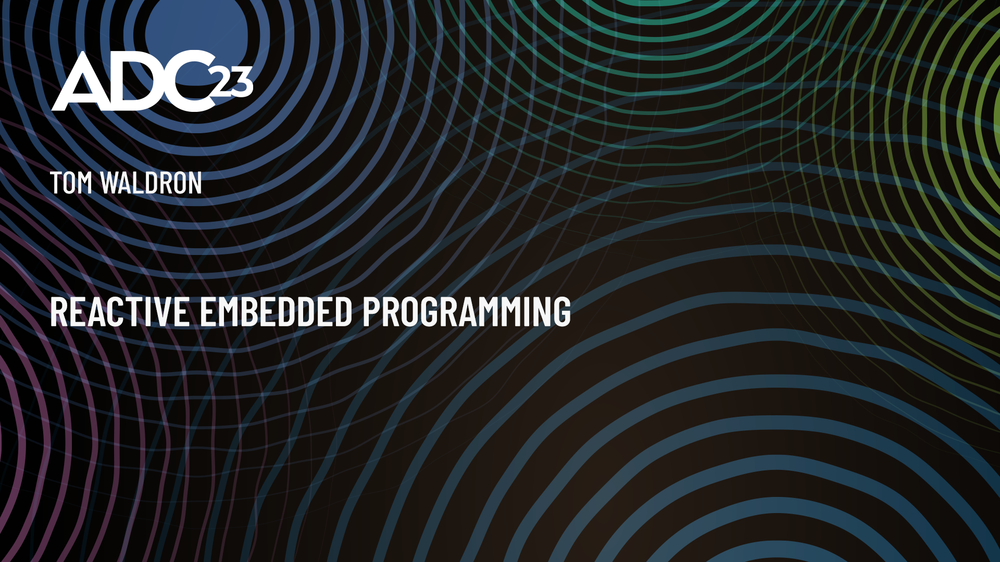

note: intro - interrupt with questions - baremetal embedded architecture - several mixed examples, confusing - pseudo code

---

#### `aboutMe`
- embedded design
- audio
- baremetal
- real time

note: embedded design 15 years - audio industry - specialise in baremetal, no OS - real time

---

#### `reactive?`

note: What exactly do I mean when I say reactive?

---

#### `reactive?`
- polling vs callbacks - async

note: system design - callbacks - events

---

#### `reactive?`
- polling vs callbacks - async
- power, cpu time efficiency

note: cpu efficiency - power efficiency - only do work when there's work to do

---

#### `reactive?`
- polling vs callbacks - async
- power, cpu time efficiency
- `-Odev`

note: easy to reason about - predictable timing - keep things simple

---

#### `part1::backgroundLoop`

note: look at regular polling architecture - background loop - superloop - common, proven architecture

---

#### `arduino`

```arduino
void setup() {
    // runs once at the start of the program
}

void loop() {
    // runs on every iteration of the background loop
}
```

note: sketches - blank sketch - setup runs first, initialisations - loop runs continuously, program logic

---

#### `arduino::cppEntryPoint`

```cpp {data-line-numbers="|4|7|"}
int main() {
    init();         // arduino initialisations

    setup();        // user provided

    for (;;) {      // background loop
        loop();     // user provided

        // ... arduino background tasks
    }
}
```

note: step up stack - generated by toolchain - c++ entry point - infinite loop

---

#### `arduino::blinky`

```arduino {data-line-numbers="|2-3|8|9|10|"}
void setup() {
    // initialize digital pin LED_BUILTIN as an output.
    pinMode(LED_BUILTIN, OUTPUT);
}

// the loop function runs over and over again forever
void loop() {
    digitalWrite(LED_BUILTIN, HIGH);  // turn the LED on
    delay(1000);                      // wait for a second
    digitalWrite(LED_BUILTIN, LOW);   // turn the LED off
    delay(1000);                      // wait for a second
}
```

note: Arduino's basic blink-an-LED on the board program - setup, assign LED pin output- drive it high and low - loop, high, wait for a second then low, etc.

---

#### `arduino::blinky`

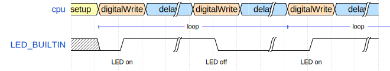

note: intro timing diagrams - explain left side items

---

```Cpp
void setup() {
    setupTaskA();
    setupTaskB();
    setupTaskC();
}

void loop() {
    taskA();
    taskB();
    taskC();
}
```

note: something a little more complex - multiple generic tasks

---

```Cpp {data-line-numbers="|2|3-5|"}
void taskA() {
    if (dataPending()) {
        const auto data = getDataFromHardware();

        process(data);
    }

    // No data, do nothing.
}
```

note: Our tasks might look something like this. We'll only actually do work if data has arrived or if there is work to do, which we check for first. Meaning that most of the time, when this task is run, it just checks and returns.

---

#### `inconsistentTiming`

note: Each iteration of the background loop and our tasks are going to consume a different amounts of CPU time, depending on whether each task actually has work to do. Best case, our timing will be somewhat inconsistent as each task has to wait for the previous one to complete before it runs. I'll show you why that's a problem.

---

#### `audioRx`
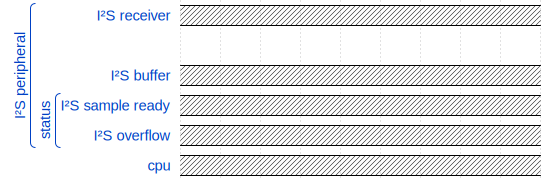

note: audio receiver - i2s - peripheral - cpu

---

#### `audioRx`
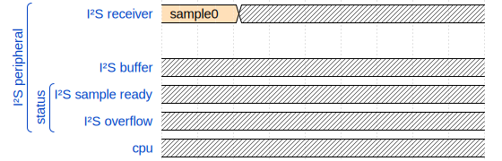

note: Here we've got an inter-IC sound peripheral bringing in samples from a converter or some digital audio source.

---

#### `audioRx`
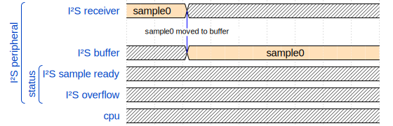

note: When the sample receive is complete, the sample is moved into a buffer ...

---

#### `audioRx`
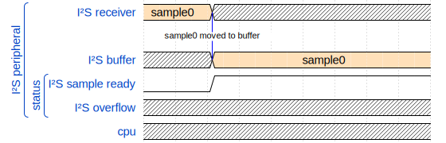

note: ... and the sample ready status flag is raised.

---

#### `audioRx`
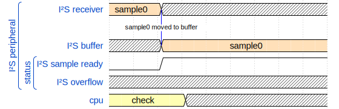

note: We happen to be checking that ready flag.

---

#### `audioRx`
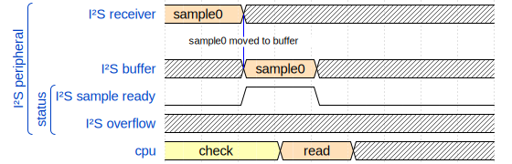

note: see flat high - reading buffer - side effects - clears buffer - ready for next sample

---

#### `audioRx`
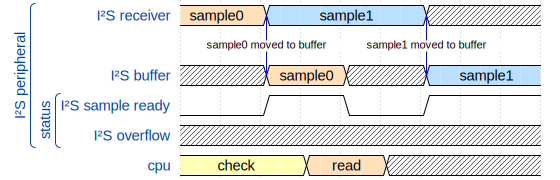

note: Next sample arrives.

---

#### `audioRx`
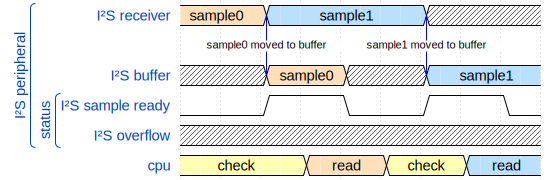

note: And so on.

---

#### `!overflow`
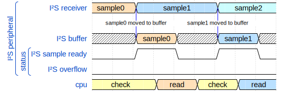

note: In this scenario all is well, we haven't overflowed.

---

#### `audioRx`
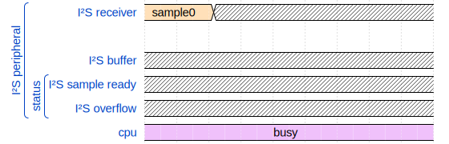

note: However, if we happen to be doing some other processing at the time ...

---

#### `audioRx`
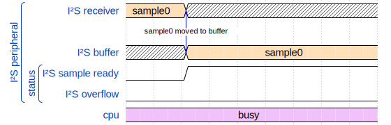

note: ... and take too long before we check the ready flag, the next sample arrives.

---

#### `audioRx`
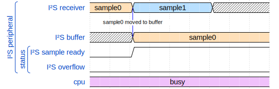

note: The next sample arrives ...

---

#### `overflow`
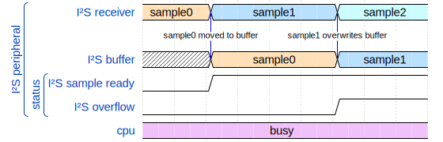

note: and overwrites the previous sample before we had a chance to read and process it. In this case, sample0 is lost forever and the overflow status flag is raised indicating the error.

---

#### `interrupts`

note: In a real system, we'd use interrupts to ensure our timing constraints are met.

---

#### `I²S`
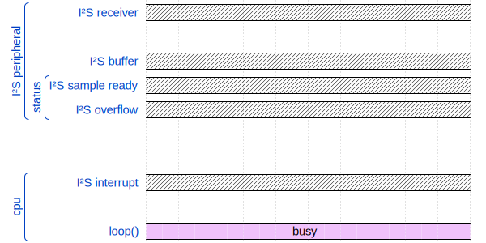

note: Here, we're our busy task is interrupted by the sample ready status flag. We read the sample from the buffer in the interrupt then go back to our busy task until the next sample is ready. This way never missing a sample.

note: Here we've got our busy task taking up all our cpu time.

---

#### `I²S`
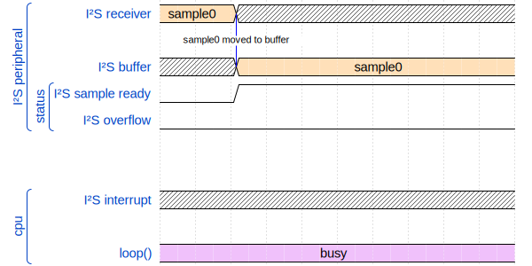

note: Our sample becomes ready ...

---

#### `I²S`


note: And this time, we've subscribed to the sample ready event.

---

#### `I²S`
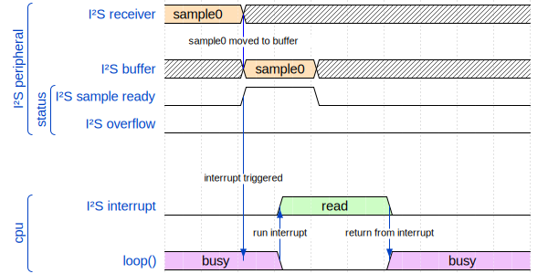

note: This event interrupts our execution of our busy loop while we read the sample, before returning to the busy loop.

---

#### `!overflow`
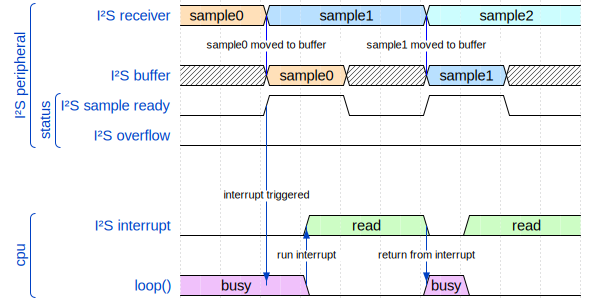

note: And so on for the other samples.

---

#### `interrupts`

```Cpp {data-line-numbers="|1-2|3|5-6|8-9|11|"}
// Placed at specific address by linker.
extern "C" void handleI2sInterrupt() {
    const auto status = I2s::readInterruptStatus();

    if (status & I2s::Status::notEmpty)
        fifo.push(I2s::readData());

    if (status & I2s::Status::overflow)
        I2s::handleOverflowError();

    I2s::clearInterruptStatus();
}
```

note: An interrupt can be enabled at the hardware level which will cause the CPU to stop whatever it's in the middle of, stash the current state and execute code at a specific address. The compiler's linker will put your ISR function in the right spot. In this case we'd have subscribed to the input-buffer-not-empty and input-buffer-overflow interrupts, so when any of those events occur we'll execute our ISR. Firstly checking why we've arrived here and dealing with each case.

---

```Cpp
void exampleReceiverTask() {
    while (DataType data; fifo.pop(data)) {
        process(data);
    }

    // No more data, return.
}
```

note: Our task now (taskA?) running on the background loop, still checks for data, but it does so via our FIFO. The timing of this function may still be inconsistent, but it doesn't matter as much because our hardware data handling is happening in interrupts.

---

#### `interrupts`
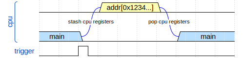

note: This basic view of an interrupt shows essentially what happens when we get an interrupt.
The interrupt is triggered my an event of some kind, which we've enabled in hardware.
We pause execution wherever we are. Save our current CPU state and execute the function at a memory address specific to the interrupt triggered, whatever function is at that address will be run. Then when we exit that function, we'll restore our previous state and continue. More on interrupts later.

---

#### `part2::scheduler`

note: We're not really going to just stick all our processing in the background loop and continuously poll. We'll get much more consistent timing if we check at a realistic frequency for each task.

---

#### `scheduler`

```Cpp
int main() {
    // initialisations
    setupTaskA();
    setupTaskB();
    setupTaskC();

    // background loop
    for (;;) {
        taskA();
        taskB();
        taskC();
    }
}
```

note: Let's recreate this but with specific timing intervals.

---

#### `scheduler`

```Cpp {data-line-numbers="|4|6-8|12|"}
int main() {
    // ... task initialisations

    Scheduler::init(1ms);

    Scheduler::add(1ms, taskA);
    Scheduler::add(10ms, taskB);
    Scheduler::add(40ms, taskC); // (25Hz)

    // background loop
    for (;;) {
        Scheduler::run();
    }
}
```

note: We'll initialise our scheduler, which we'll look at in a minute. Then we'll add our tasks, passing the functions in along with the specific timing. Then all we do in the background loop is call our run function which will run our functions at the requested times.
e.g. sensor processing
e.g. user interface
e.g. display refresh (25Hz)

---

#### `scheduler`

```Cpp
Scheduler::init(std::chrono::milliseconds res) {
    Timer::init(res);
    Timer::enableInterrupt(Int::update, Int::Priority::low);
}
```

note: The scheduler initialiser is going to setup a timer to update every millisecond, or whatever interval is required, with an interrupt to fire on each trigger.

---

#### `scheduler`

```Cpp
/// @returns `false` if scheduler is full, otherwise `true`.
bool Scheduler::add(std::chrono::milliseconds runEvery,
                    std::add_pointer_t<void()> function) {
    auto& events = Scheduler::getEventsList();
    return events.add(runEvery, function);
}
```

note: The scheduler's add function's going to bung this information onto list of events, which will likely just be a fixed array, so it might be full. In this case we're just getting a pointer to a static function, but you could use inplace_function here if you wanted something more versatile.

---

#### `scheduler`

```Cpp {data-line-numbers="|4|5|7-9|"}
extern "C" void timerInterruptHandler() {
    const auto status = Timer::readInterruptStatus();

    if (status & Timer::Status::update) {
        auto& events = Scheduler::getEventsList();

        for (int i = 0; i < events.size(); ++i) {
            events[i].update();
        }
    }

    Timer::clearInterruptStatus();
}
```

note: Our timer interrupt is going to run every millisecond and in there we'll just go through our list of events and update their counters.

---

#### `scheduler`

```Cpp {data-line-numbers="|8|9|"}
// called from background loop
void Scheduler::run() {
    auto& events = Scheduler::getEventsList();

    for (int i = 0; i < events.size(); ++i) {
        auto& event = event[i];

        if (event.shouldRun())
            event.run();
    }
}
```

note: The scheduler run function is just going to go through the events and check the counter value against the timing value that we set earlier. `shouldRun()` will return true if enough time has passed since the last time we ran. Then when we call `run()` here, we'll execute the task and internally it'll reset its counter.

---

#### `scheduler`
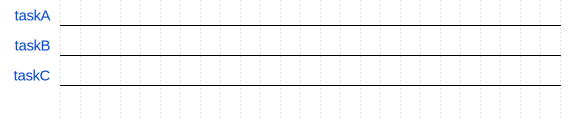

---

#### `scheduler`
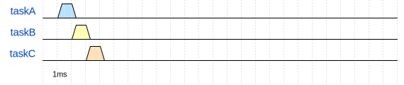

note: Here I'm showing each task running one at a time as we're single cpu, and at each mark we're running our scheduled tasks sequentially.
At 1ms after our scheduler is enabled, we'll run all our tasks unless we setup it up so that everything starts at the next iteration, which might be wise. But for now we'll just assume a naive implementation.

---

#### `scheduler`
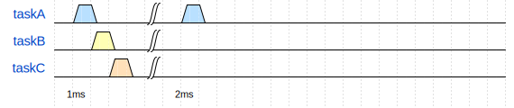

note: At 2ms, we'll run task A again.

---

#### `scheduler`


note: Skipping to 10ms taskB is triggerred.

---

#### `scheduler`
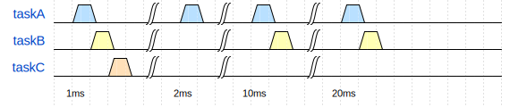

note: And so on.

---

#### `scheduler`
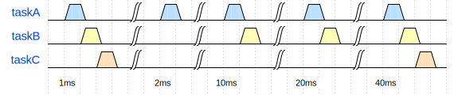

note: Eventually calling taskC.
Note that you could implement this staggered so that that taskB and taskC aren't triggered on the same boundary, but again, assuming naive implementation here, just to keep things simple.

---

#### `scheduler::bug`


note: Can we break this scheduler? Does this design have a flaw? What happens if one of these tasks takes longer than a millisecond to execute?
I once worked on a small project which was a quick-as-possible demo proof-of-concept side-project where we basically took an existing design and just scaled it up. Sounds simple enough, and seemed to be until we started running the thing and strange things started happening.

---

#### `scheduler::bug`

note: brief tangent - worked on quick proof-of-concept project

---

#### `scheduler::bug`

- legacy codebase

note: take a legacy product - and code

---

#### `scheduler::bug`

- legacy codebase
- scale up - 'make it bigger'

note: the idea - what could possibly go wrong? - fun project

---

#### `scheduler::bug`

- legacy codebase
- scale up - 'make it bigger'
- strange behaviour

note: buggy - unpredictable - long time to diagnose the issue

---

#### `scheduler::bug`
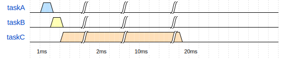

note: this is what happened - one process/task didn't scale well

---

#### `scheduler::bug`
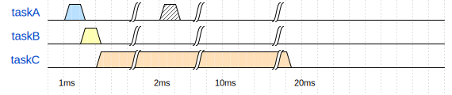

note: single cpu microcontroller - blocked

---

#### `scheduler::bug`
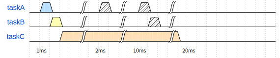

---

#### `scheduler::bug`
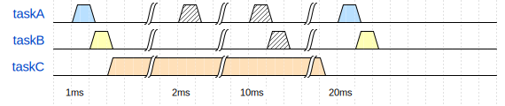

note: system still working - interrupts still serviced - incoming data at risk of overflowing - outputs at risk of starvation - timing all over the place - mysterious bugs

---

#### `possibleSolutions`

- larger buffers
- split
- real-time operating system (RTOS)

note: larger buffers, block processing no data lost - split using state machine - freeRTOS

---

#### `possibleSolutions`

- ~~larger buffers~~ > latency
- split
- real-time operating system (RTOS)

note: changes in latency

---

#### `possibleSolutions`

- ~~larger buffers~~ > latency
- ~~split~~ > complexity
- real-time operating system (RTOS)

note: dev time - complexity - significantly longer exe time if run on timer - how to split unknown system without breaking

---

#### `possibleSolutions`

- ~~larger buffers~~ > latency
- ~~split~~ > complexity
- ~~real-time operating system (RTOS)~~ > footprint

note: I didn't feel that we had the memory footprint to add an real-time operating system, though thinking back, that would probably have been fine.
Anyway, those are my excuses and I'm sticking to them. We're engineers, we could probably make any of these options work, but I went in a different direction.

---

#### `scheduler::fix`
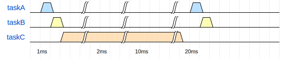

note: What do I really want to happen here? - let taskC take time - pause for other tasks

---

#### `scheduler::fix`
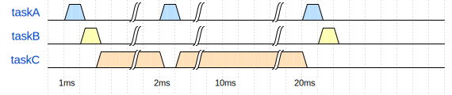

note: At the 2ms mark, we'd pause taskC, run A and return to C.

---

#### `scheduler::fix`
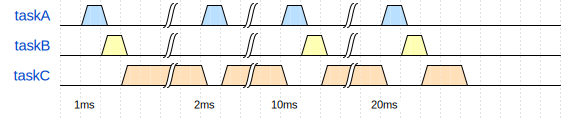

note: Same again at 10 and 20ms - taskC take a little longer - preferable to delaying A and B - looks similar to interrupts

---

#### `scheduler`

```Cpp {data-line-numbers="|6-8|"}
int main() {
    // ... task initialisations

    Scheduler::init(1ms);

    Scheduler::add(1ms, taskA, Priority::high);
    Scheduler::add(10ms, taskB, Priority::high);
    Scheduler::add(40ms, taskC);

    // background loop
    for (;;) {
        Scheduler::run();
    }
}
```

note: pull this off - tell the scheduler priority

---

#### `scheduler`

```Cpp {data-line-numbers="|10-11|"}
extern "C" void timerInterruptHandler() {
    const auto status = Timer::readInterruptStatus();

    if (status & Timer::Status::update) {
        auto& events = Scheduler::getEventsList();

        for (int i = 0; i < events.size(); ++i) {
            events[i].update();

            if (event.shouldRun(Priority::high))
                event.run();
        }
    }
...
```

note: in our timer interrupt - specialised version of our shouldRun() - checks and then runs tasks which are high priority - executing here means executing in interrupt

---

#### `interrupts`

- short
- fast
- flags

note: interrupts supposed to be - set a flag and return - can we do this?

---

#### `preemptiveInterrupts`

note: nowadays likely - interrupt controller - interrupts interrupting interrupts - priority based

---

#### `preemptiveInterrupts`
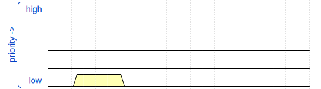

---

#### `preemptiveInterrupts`
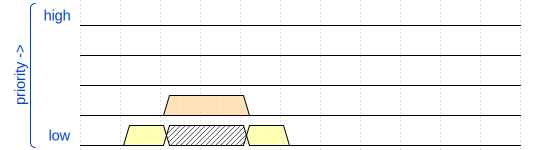

---

#### `preemptiveInterrupts`
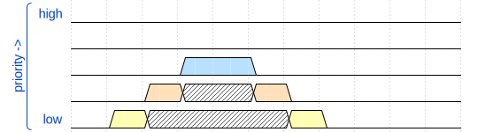

---

#### `preemptiveInterrupts`
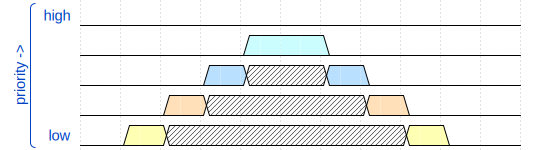

---

#### `preemptiveInterrupts`
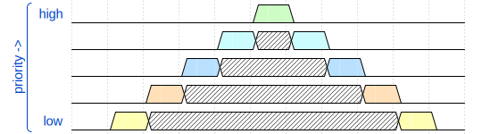

---

#### `preemptiveInterrupts`
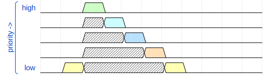

note: interrupts trigger at the same time - serviced in priority order - ARM NVIC - preemptive scheduler implemented in hardware

---

#### `interruptScheduler`


note: If we look back at our timer-based scheduler...

---

#### `interruptScheduler`

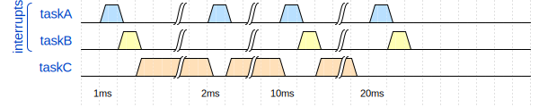

note: We're able to achieve this by running task A and B in interrupt context.

---

#### `interruptPriority`

- hardware triggered interrupts
- software/user triggered interrupts

note: distinguish between - special consideration - hardware interrupts - hard real time

---

#### `interruptPriority`

```
highPriority
˄   hardwareHigh
|   hardwareLow
|   softwareHigh
˅   softwareLow
lowPriority
```

note: hw interrupts precedence - split/group priorities - design system around timing constraints

---

#### ```part3::reactive```

note: Where do we go from here. We're already running most of the system in interrupts via our scheduler. What's next?
I'm now going to move away from needing this scheduler. I want to use the interrupt controller as a scheduler that runs in hardware.

---

#### `I²S`


note: Looking back at the audio input system - I'm going to rearrange this a little so that our samples are being collected via dma.

---

#### `I²S`
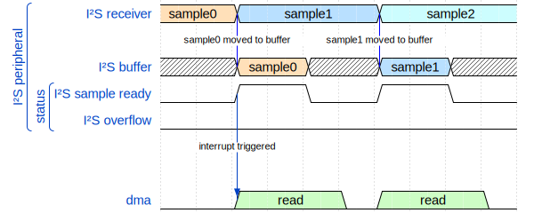

note: DMA gives our peripheral controller access to the memory bus, so it can push its data directly without us actually needing an interrupt to do it, then we can setup a DMA interrupt to alert us when we're got a buffer of audio data ready to process.

---

#### `I²S`
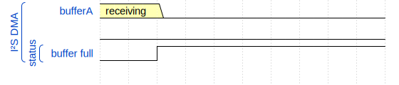

note: Instead of a single sample, we've got this buffer coming in and an interrupt to tell us when it's full.

---

#### `I²S`
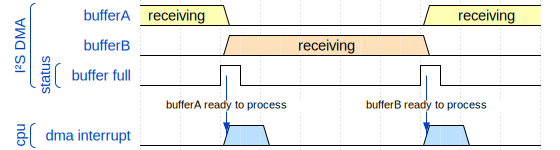

note: In this interrupt we'll tell the DMA to start filling another buffer, which leaves us with a nice buffer (bufferA) of audio data, ready to process.
Now, we could wait for our scheduled process function, e.g. 1ms function, to do our audio work, but I don't want to do that. I've got the data, I'd like to handle it right now. I want to react to this data becoming available.

---

#### `I²S`
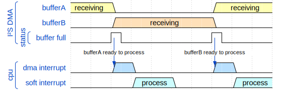

note: What I want is to schedule a software interrupt, from the hardware DMA interrupt. The software interrupt is going to be our version of an audio thread. This thread is high priority in terms of our software interrupts, but it must have a lower priority than our hardware interrupts. As such, even though we're triggering this interrupt from the DMA interrupt here, it won't actually run until the DMA interrupt is finished.

---

#### `pseudoCoroutine`


note: I'm going to refer to this software interrupt process as a pseudo coroutine.

---

#### `pseudoCoroutine`

```Cpp {data-line-numbers="|4|5-6|8-12|"}
extern "C" void dmaInterruptHandler() {
    const auto status = Dma::readInterruptStatus();

    if (status & Dma::Status::bufferFull) {
        Dma::swapBuffer();
        Dma::enable();

        Scheduler::execute(
            Scheduler::Priority::high,
            [buffer = Dma::getAltBuffer()]{
                Audio::process(buffer);
            });
    }
...
```

note: A possible example of what this might look like. If our buffer is full, swap for the alternate buffer and reenable the dma transfers. It may well be the case that you won't need to actually do that yourself. I think STM32's from F2 upwards have DMA's which have double buffering built in, so that could be automatic.
Then we'll schedule our coroutine to run and process the buffer that the DMA isn't using. We'll imagine that getAltBuffer returns a std::span or something like that, pointing to a static array.

---

#### `pseudoCoroutine`

```Cpp {data-line-numbers="|5-7|8|9-10|11|"}
#include <inplace_function.h>

void Scheduler::execute(Scheduler::Priority priority,
                        stdext::inplace_function func) {
    auto timer = Timers::getAvailableTimer();

    if (timer.hasValue()) {
        timer->setInterruptFunction(func);
        timer->enableInterrupt(
            Scheduler::getInterruptProperty(priority));
        timer->enableOneShot(0); // interrupt now pending
    }
    else { /* error */ }
}
```

note: Then inside the execute function. Now bare in mind this definitely isn't the only way to schedule an interrupt, this is just a method which might be quite simple to implement and doesn't require any other processing, and usually there are plenty of timers to use. This is what I might call optimised for the developer.
We're getting a timer from say a pool of timers, some system where we're keeping track of our hardware timers. This might return a std::optional so we can check for errors.
We'll set our function that we want to run when the timer interrupts and enable the timer interrupt with a translation of the priority - remember, a scheduler's high priority won't be the highest actual interrupt priority because we've still got hardware interrupts to worry about.
Then we'll enable the timer in one-shot mode, so once it triggers it disables itself, and we'll set the timer to time out right now, at which point the timer interrupt will be pending, waiting for this thread - which is a higher priority (hardware) thread - to finish.

---

#### `pseudoCoroutine`

```Cpp {data-line-numbers="|1-2|5-7|"}
extern "C" void timer14InterruptHandler() {
    auto& timer = Timers::getTimer(14);
    const auto status = timer.readInterruptStatus();

    if (status & Timer::Status::update
            && timer.intFunction) {
        timer.intFunction();
        timer.setInterruptFunction(null);
    }

    timer.clearInterruptStatus();
}
```

note: Let's say in this case we got timer 14, once the DMA interrupt exits, we'll enter timer 14's interrupt handler, get the corresponding timer, then if the interrupt function is valid, run it.
You'd probably abstract some of that as every timer interrupt handler will want to do something similar, and you may want more safety checks.

---

#### `pseudoCoroutine`
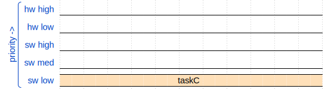

note: To quickly recap. Let's say we're running taskC, which is running at our lowest priority interrupt level.

---

#### `pseudoCoroutine`
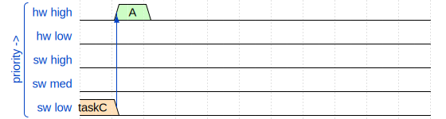

note: TaskC gets interrupted by a hardware interrupt. We've got some data for task A so the interrupt schedules taskA as its pseudo coroutine.
A schedules taskA

---

#### `pseudoCoroutine`
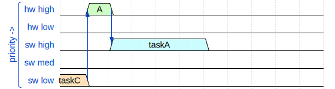

note: TaskA gets going as soon as the hardware interrupt exits.

---

#### `pseudoCoroutine`
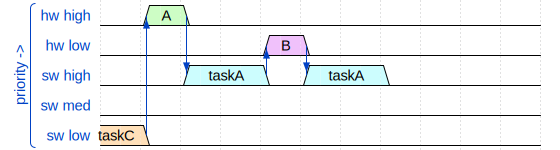

note: TaskA gets interrupted by another hardware interrupt, this time with data for taskB, so taskB is scheduled but remains pending for now as taskA still has work to do and is a higher priority.

---

#### `pseudoCoroutine`
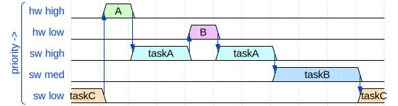

note: As soon as taskA finishes, taskB can execute before dropping back to taskC.

---

#### `typicalScheduler`

```Cpp {data-line-numbers=""}
int main() {
    // ... task initialisations

    Scheduler::init(1ms);

    Scheduler::add(1ms, taskA);
    Scheduler::add(10ms, taskB);
    Scheduler::add(40ms, taskC); // (25Hz)

    // background loop
    for (;;) {
        Scheduler::run();
    }
}
```

note: Now if we look back at our old scheduler...

---

#### `reactiveScheduler`

```Cpp {data-line-numbers=""}
int main() {
    // Tasks will schedule their own pseudo-coroutines
    // or timer interrupts.
    setupTaskA();
    setupTaskB();
    setupTaskC();

    // background loop
    for (;;) {
        // sleep
        asm volatile("wfi");    // "wait for interrupt"
    }
}
```

note: We don't really need that scheduler here any more as we're letting our various tasks schedule their own timer-based coroutines.
Our background loop no longer needs to do anything, so it can just sleep. This wfi instruction is an ARM instruction which puts the CPU into low-power mode, ready to be woken by an interrupt.
Each time we interrupt, we'll come back here, iterate the loop and go back to sleep.
We could do other things in here such as count the amount of time that the system is idle, rudimentary benchmarking.
Or we could even get rid of the background loop entirely.

---

> "If the SLEEPONEXIT bit of the SCR is set to 1, when the processor completes the execution of an exception handler, it returns to Thread mode and immediately enters sleep mode. Use this mechanism in applications that only require the processor to run when an exception occurs." - PM0214, 2012

note: Here's a quote from the datasheet. Exception handler is datasheet speak for interrupt, thread mode just meaning normal executions outside of interrupt.

---

#### `backgroundLess`

```Cpp {data-line-numbers=""}
int main() {
    // Tasks will schedule their own pseudo-coroutines
    // or timer interrupts.
    setupTaskA();
    setupTaskB();
    setupTaskC();

    // Enable Cortex-M SLEEPONEXIT mode by writing a '1'
    // to System Control Register bit 1.
    // i.e. sleep unless in interrupt
    SCB->SCR |= (1u << 1);
}
```

note: Cortex M devices have a handy feature where you can tell the CPU to sleep unless it's running an interrupt, saving us from returning to an empty main function.

---

#### `wrapUp`

note: why do this or when should you use this? No hard set rules

---

#### `wrapUp`

- timing

note: reason about, priorities, counting in bg, lots of tasks/threads

---

#### `wrapUp`

- timing
- lightweight

note: lightweight compared to a full rtos, done in hardware

---

#### `wrapUp`

- timing
- lightweight
- interesting alternative

note: nothing wrong with other approaches, learning tool

---

#### `wrapUp`

- timing
- lightweight
- interesting alternative
- nordic softdevice

note: possible other systems

---

#### `wrapUp`

- timing
- lightweight
- interesting alternative
- nordic softdevice
- reliability

note: most important thing - structure project by importance - if there's something that must not fail, put it on top

---

#### `wrapUp`

- timing
- lightweight
- interesting alternative
- nordic softdevice
- reliability
- in production

note: if you trust your hardware

---

#### `caveats`

note: things to know

---

#### `caveats`

- preemptive

note: must be able to interrupt itself - structure - priorities

---

#### `caveats`

- preemptive
- timers

note: lots of timers in example - other ways - crect use interrupt vector table

---

#### `caveats`

- preemptive
- timers
- security

note: interrupts = elevated privileges

---

#### `caveats`

- preemptive
- timers
- security
- timing

note: timing consequences

---

#### `caveats`

- preemptive
- timers
- security
- timing
- synchronising

note: sharing data

---

#### `caveats`

- preemptive
- timers
- security
- timing
- synchronising
- cortex-m0 / ARMv6-M

note: stm32G0 4 priorities - ARMv6-M no exclusive load/store

---

#### `furtherReading`

emBO++ 2018 - Emil Fresk: crect the compile time, reactive scheduler

Fabian Renn-Giles & Dave Rowland - Real-time 101

pendSV

---

#### `reactiveEmbeddedProgramming`

- diagrams made using wavedrom.com/editor
- concepts tested on STM32 single core microcontrollers
- thanks to ADC for having me
- thank you for listening
- github.com/baremetaldev
- baremetal.dev ... coming soon

---

#### `bonus::synchronising`

--

#### `bonus::synchronising`

- volatile?

--

#### `bonus::synchronising`

- ~~volatile?~~

--

#### `bonus::synchronising`

- ~~volatile?~~
- atomic_T / std::atomic<T>?

--

#### `bonus::synchronising`

- ~~volatile?~~
- atomic_T / std::atomic<T>

--

#### `bonus::synchronising`

- ~~volatile?~~
- atomic_T / std::atomic<T>
- `std::atomic<T>::is_always_lock_free`

--

#### `bonus::synchronising`

- ~~volatile?~~
- atomic_T / std::atomic<T>
- `std::atomic<T>::is_always_lock_free`
- `cpsid / cpsie`

---

#### `bonus::freeRTOS`

--

#### `bonus::freeRTOS`

- `ulTaskNotifyTake()`
- `xTaskNotifyGive()`
- `vTaskNotifyGiveFromISR()`
- https://embeddedartistry.com/blog/2018/05/28/freertos-task-notifications-a-lightweight-method-for-waking-threads/

note: create coroutine task, sleep until notified from ISR

---

#### `bonus::interruptVectorTable`

---

#### `bonus::interruptVectorTable`

startup asm

```
.word  _estack
.word  Reset_Handler

.word  NMI_Handler
.word  HardFault_Handler
.word  MemManage_Handler
.word  BusFault_Handler
.word  UsageFault_Handler
.word  0
.word  0
.word  0
.word  0
.word  SVC_Handler
...
```

note: startup assembly - vector table defined in memory - handler functions placed at these addresses

---

#### `bonus::interruptVectorTable`

gaps

```
.word     DCMI_IRQHandler           /* DCMI     */
.word     0                         /* Reserved */
.word     0                         /* Reserved */
.word     FPU_IRQHandler            /* FPU      */
.word     0                         /* Reserved */
.word     0                         /* Reserved */
.word     SPI4_IRQHandler           /* SPI4     */
.word     0                         /* Reserved */
.word     0                         /* Reserved */
.word     SAI1_IRQHandler           /* SAI1     */
.word     0                         /* Reserved */
.word     0                         /* Reserved */
...
```

note: reserved gaps may still be internally connected - might be possible to use these

---

#### `bonus::interruptVectorTable`

task handlers

```
.word     DCMI_IRQHandler           /* DCMI     */
.word     taskA_Handler             /* Reserved */
.word     taskB_Handler             /* Reserved */
.word     FPU_IRQHandler            /* FPU      */
.word     taskC_Handler             /* Reserved */
.word     0                         /* Reserved */
.word     SPI4_IRQHandler           /* SPI4     */
.word     0                         /* Reserved */
.word     0                         /* Reserved */
.word     SAI1_IRQHandler           /* SAI1     */
.word     0                         /* Reserved */
.word     0                         /* Reserved */
...
```

note: task handlers directly in the table - no need to use timers
